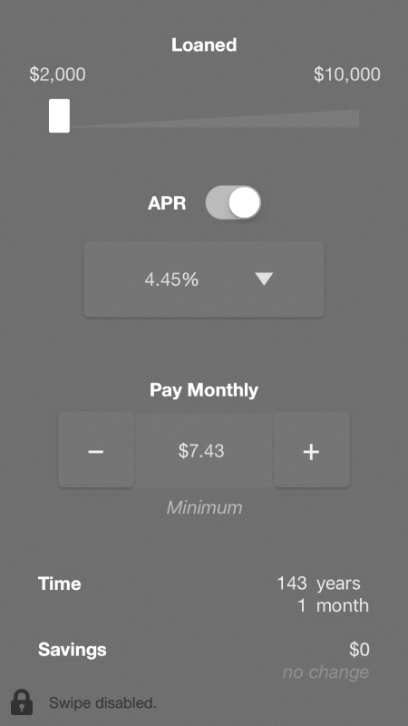
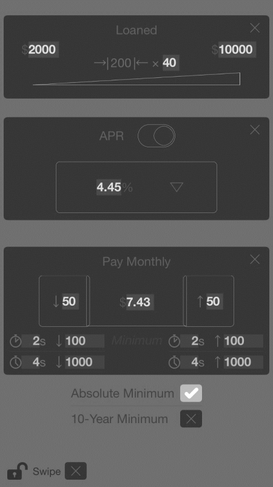
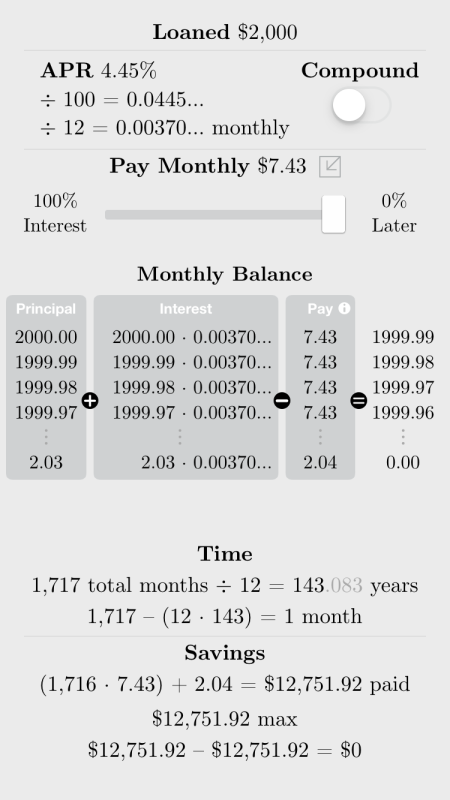

---
# for rendering with R
title: "*✓ Student Loans*"
output: 
  word_document:
    pandoc_args: ["--lua-filter=gitlab-math.lua"]
---

<!--
  # for captions
  word_document:
  fig_caption: true

  # for reference document
  word_document:
    reference_docx: template.docx
-->

# Materials Required

* Question 1 tailored to one’s institution
* iOS app downloaded and installed or deployed on all devices
* Handouts (i.e., course material) for each participant

# Script

Distribute all handouts, and as you do, discuss:

> &emsp; "Six months after students graduate college, they will be required to start repaying their student loans, if any, and to do so monthly. We will focus on helping students to start thinking about that. If you are not a student, either imagine that you are one, or consider the scenario that you are paying your child’s tuition. We will work on keeping track of how much money you may be borrowing from the government and planning how you can repay what you borrowed."

Skim questions 1 through 6; mention to your audience that it need not
use real numbers, only numbers that are reasonable. Share some quick
examples of “reasonable” numbers. The audience is permitted to use
calculators, work in groups of two and round its results. State:

> &emsp; "Please get started. If you have any questions or concerns, please feel free to ask or inform me, and I will be here to help. Questions 7 through 15 are optional."

Wait 10 to 15 minutes, then say:

> &emsp; "After you complete the set of questions, you are welcome to keep them. You are welcome to keep the app, too. If you, instead, would like to return the set of questions to me, I will be happy to provide you feedback."

If any participants complete bonus questions 7 and 8, mention that you
hope he or she will identify the answer to question 6 as a “sweet spot.”
If anyone completes questions 9 to 14, mention that you hope they will
find the questions more compelling, and that they try to raise their
monthly payment more.

\newpage <!-- LaTeX only -->

# iOS App Overview for Instructors’ Personal Reference

<!-- 
A caption will only show if its image is by itself on its own line.
Therefore, no captions will show if images are inline.

Alternative: construct a table with captions.
Problem is that tables need header rows, so use captions in the header.
-->

| Video Introduction | Main Screen | Main Screen\  (Editing Mode) | Mathematics Screen\  (Swipe Enabled) |
|:-:|:-:|:-:|:-:|
||||| <!-- empty line -->
|  |  |  |  |

Figure: Screenshots

Once the app loads, it plays a video that illustrates how one can
utilize the app. Close the video to access the main screen. In the main
screen, one can move the thumb of the Loaned slider, press on the thumb
of the APR switch, select a different percentage, or click on either the
minus or plus button. Whenever one does so, the Pay Monthly, Time,
Savings and change in Savings amounts are computed automatically. One
can reset the amounts by either pressing and holding the minus button
or–in editing mode–entering 0 for the Pay Monthly amount. Press on the
padlock icon to enter the editing mode. In editing mode, one can also
edit the slider, percentage, increment timers, and minimum payment; one
can enable the ability to swipe leftward, too. By default, the minimum
payment is the minimum for repaying student loans within ten years.

If swiping is enabled, one can swipe leftward–regardless if one is in
editing mode–to view how estimates were calculated (i.e., to access the
mathematics screen). In the mathematics screen, one can also examine how
Time and Savings amounts would vary, depending if interest was
compounded and on the percentage of interest one paid monthly. By
default, interest is not compounded and one pays 100% interest monthly.
Minimize the Pay Monthly amount, at any time, by pressing
. Swipe rightward to return to either the main
screen or main screen in editing mode. 4.45% is the Direct Loan rate for
July 1, 2017 to June 30, 2018. The current interest rate is 4.53%. The
app’s build is 2.7.3 (141), where “2.7.3 (141)” stands for major
version 2, minor version 7, revision 3 and build 141.

\newpage

# Part 1 – **NO** app

**Directions: please answer the following
questions WITHOUT using the app.**

1. What is your yearly cost of tuition? (excluding fees)
**$ _______________**

&nbsp;
&nbsp;

*Feel free to use the following chart to help you:*

| TUITION RATES | Full Time | Part-Time |
|:-|:-|:-|
| **Residents of New York City who are:** | | |
| Matriculated Students | $2400 per semester | $210 per credit |
| Non-Matriculated Students | $265 per credit | $265 per credit |
| **Non-Residents of New York City who are:** | | |
| Residents of New York State with B-81 on file | $2400 per semester | $210 per credit |
| Residents of New York State without B-81 on file | $320 per credit | $320 per credit |
| Out-of-State Residents | $320 per credit | $320 per credit |
| International Students | $320 per credit | $320 per credit |
| Non-Matriculated Students | $420 per credit | $420 per credit |

**Source:** [URL]

*"Full time" is 12-18 credits/equated credits.*  
*"Matriculated" means to be enrolled in a degree program.*  
*"B-81" is a Certificate of Residence.*
<!-- two empty spaces after end of sentence creates new paragraph -->

&nbsp;
&nbsp;

*Assume you borrow money from the government to pay for your degree. Six
months after you graduate college, you will be required to start paying
the government back monthly.*

2\. How much money can you afford to pay back each month?
**$\_\_\_\_\_\_\_\_\_\_\_\_\_\_\_**

> *A reasonable guess is fine.*

3\. How long will it take to pay the government back?
(**excluding** interest)

**\_\_\_\_\_ year(s) \_\_\_\_\_ month(s)**

4\. *Examples:*

*5,000 ÷ 200 = 25 months 25 = 2 years
1 month*

*7,650 ÷ 250 = 30.6 months ↑31 = 2 years
7 months*

*3,132 ÷ 300 = 10.44 months ↑11 = 11
months*

# Part 2 – app

**Directions: please answer the following
questions USING the app.**

4\. How long will it take to pay the government back?
(**including** interest)

> *Ignore savings, for now.*

**\_\_\_\_\_% \_\_\_\_\_ year(s) \_\_\_\_\_ month(s)**

4\.

*Tips to help you get started:*

  - Move the thumb of the slider, to select an estimated cost nearest to
    yours.

  - Press ▼ to select the interest rate of your loan.
    
    If you have more than one type of loan
    or you have multiple loans, select
    the rate for the biggest one.
    
    If you are unsure about your rate, choose 4.53% since Direct Loans
    are more common.

  - Press – or + to select a monthly payment nearest to yours.

  - To edit the slider, interest rate or monthly payment, press the
    padlock icon. After editing them, relock.

5\. Compared to \#3, is your result for \#4 reasonable? Why or why not?

*(yes/no)* **\_\_\_\_\_\_\_\_\_**

*(explain)*
**\_\_\_\_\_\_\_\_\_\_\_\_\_\_\_\_\_\_\_\_\_\_\_\_\_\_\_\_\_\_\_\_\_\_\_\_\_\_\_\_\_\_\_\_\_\_\_\_\_\_\_\_\_\_\_\_\_\_\_\_\_\_\_\_\_\_\_**

> *Feel free to consult a partner.*

6\. Increase your monthly payment gradually. How much *should* you pay
monthly, so that your repayment does not take so long?

> *Many answers are possible.* **$\_\_\_\_\_\_\_\_\_\_\_\_\_\_\_**
> 
> *A single amount, or range of amounts, is fine.*

*If you ever struggle to make payments, you
can contact your lenders and negotiate
with them.*

*  
*

# Bonus Questions – app

**Directions: please answer the following
questions USING the app.**

*Questions 7 through 8 reinforce question 6.*

7\. Reduce your monthly payment to the minimum. From the minimum, press
+ once. How much money can you save?

*To see how the app calculates savings, press the padlock icon;*
**$\_\_\_\_\_\_\_\_\_\_\_\_\_\_\_**

*enable the ability to swipe; and swipe leftward.*

8\. Press + some more times. Does paying *a lot* more make much
difference? *(yes/no)* **\_\_\_\_\_\_\_\_\_**

*Hint: the difference in savings will decrease exponentially. Observe
the bottom-right number.*

*Press the padlock icon, and change the minimum to absolute. Press the
icon to relock it.*

**Note: The 10-year minimum is**
**the minimum for repaying student loans within
ten years, NOT for repaying student loans for at least ten
years.**

9\. Reduce your monthly payment to the absolute minimum. Look at how
long it will take to pay the government back. Do you see why lenders set
time limits, typically 10 years?

*(yes/no)* **\_\_\_\_\_\_\_\_\_**

10\. Repeat \#7 and \#8. How much money can you save? Does paying *a
lot* more make much difference?

**$\_\_\_\_\_\_\_\_\_\_\_\_\_\_\_** *(yes/no)* **\_\_\_\_\_\_\_\_\_**

11\. How would you answer \#6, now? (Would you pay more?) *(yes/no)*
**\_\_\_\_\_\_\_\_\_**

*Press the padlock icon; enable the ability to swipe; and swipe
leftward.*

12\. Reduce your monthly payment to the absolute minimum, again. Pay
less interest each month. In other words, pay more principal. Do you
save any money? Why or why not?

*(yes/no)* **\_\_\_\_\_\_\_\_\_**

*(explain)*
**\_\_\_\_\_\_\_\_\_\_\_\_\_\_\_\_\_\_\_\_\_\_\_\_\_\_\_\_\_\_\_\_\_\_\_\_\_\_\_\_\_\_\_\_\_\_\_\_\_\_\_\_\_\_\_\_\_\_\_\_\_\_\_\_\_\_\_**

*Press and hold monthly balance numbers, to magnify them. Click on* ⓘ
*for a breakdown of each payment.*

13\. Repeat \#12, but compound the interest. Do you save any money? Less
or more money?

*(yes/no)* **\_\_\_\_\_\_\_\_\_**

*(explain)*
**\_\_\_\_\_\_\_\_\_\_\_\_\_\_\_\_\_\_\_\_\_\_\_\_\_\_\_\_\_\_\_\_\_\_\_\_\_\_\_\_\_\_\_\_\_\_\_\_\_\_\_\_\_\_\_\_\_\_\_\_\_\_\_\_\_\_\_**

14\. Knowing, overall, how interest affects your ability to pay the
government back, how would you answer \#6 now? (Would you pay more?)

*(yes/no)* **\_\_\_\_\_\_\_\_\_**

*Question 15 is asked purely to provoke discussion.*

15\. Do you save any money, if you pay more than the minimum but are not
charged interest?

*Return to the main screen, and turn the* APR *switch off.*

*(yes/no)* **\_\_\_\_\_\_\_\_\_**
